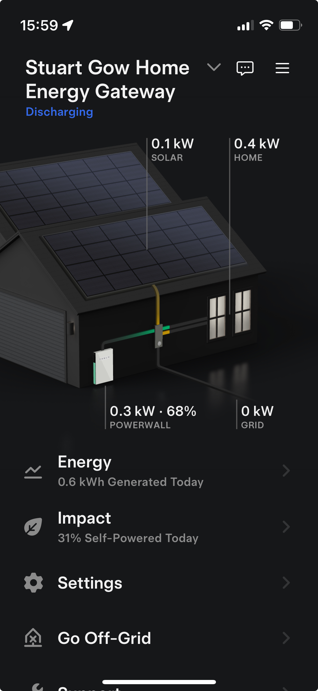

```{r setup, include=FALSE}
knitr::opts_chunk$set(echo = TRUE)
```

# Introduction

(20 Marks)

-   Origin
-   Why is it important to me
-   Show first 5 or 6 lines of data to help understanding


## Scope of The Data

This analysis looks at the generation and domestic use of solar engergy during September 2024 in the southern highlands of Scotland. The objectives of this analysis are to see how well solar generation covers the demands of a domestic residence at the tail end of the summer and to determine if additional solar generation and battery storage is needed. Being able to ensure solar generated power covers all household needs is important as this reduces the financial cost of having to import electricity from the national power grid.

-   ?? Solar linked to sunshine/irradiance?
-   ?? How well does solar generation cover house consumption? How much is the grid still used?
-   ?? How much is house consumption impacted by absence?
-   ?? What impact does temperature have? On house consumption? On solar generation?

The data comprises three main parts:

-   Weather: Daily temperature and solar irradiance readings (see note below)
-   Power Generation & Use: Daily solar energy generated and consumed
-   House Occupation: A simple flag to indicate if the house is occupied or not

### Weather

Weather data is sourced from a local weather station, see <https://www.blscc.org/weather>. Temperature is the mean daily temperature in $^\circ$C and is derived from 6 readings taken at 4 hourly intervals during a 24 hour period. Solar irradiance is a measure of the solar energy experienced over a specified area, it is measure in W/m$^2$; typically this is used to actually caluclate the power generated from an array of solar panels, but here it is used here as a proxy for daily sunshine hours because this data was not available.

### Power Generation & Use

Power data is downloaded from an iPhone App that controls the distribution of power to the domestic house being analysed, see Figure 1. This is a Tesla Powerwall and controller that takes electricity from: i) an array of 36 solar panels; ii) battery storage; iii) the national power grid and then intelligently routes this for: i) consumption by the house; ii) battery storage; iii) export to the nationla power grid. Electricty is measured here in kWh.

It should be noted that there are some lmitations in the data that could be obtained. Onlu solar generation and house consumption was used and energy flow to and from the battery was not readily available.

{width="25%"}

### Data Analysed

Once the three sources of data have been collated the dataset for analysis consists of the below:
```{r}
# Import and display data from the tab-seperated data file

```


# Methods and Results

(40 marks)

# Conclusions

(20 marks)

xxxxxxxx

Test citations [@Crawley2014] and as @Fraix-Burnet2016

## References


?? Bother to quote a link to Wikipedia? [See Wikipedia](https://en.wikipedia.org/wiki/Solar_irradiance#:~:text=Solar%20irradiance%20is%20the%20power,m2%20in%20SI%20units.)

