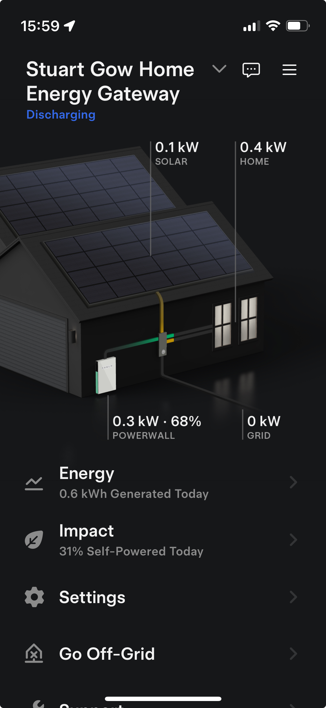

```{r setup, include=FALSE}
knitr::opts_chunk$set(echo = TRUE)
library(knitr)
options(digits = 4)
```

# Introduction

## Scope & Objectives

About six years ago, I decided to remove my reliance on oil and to reduce my use of electricity imported from the National Grid. My aim was to try to reduce my energy costs and also to make a small contribution towards reducing the use of fossil fuels. So I obtained installation costs and received estimates of how much energy I could generate by using solar panels. The existing setup of oil powered central heating was replaced by the installation of a solar panel array, battery storage and ground source heat pump. I hoped to be able to only have to import from the grid when solar generation and storage failed to meet the demands of the house.

The main objective of this analysis is to see if the installation has met the predictions made during the sales process and to what extent I no longer have to rely on imported electricity, or, in other words, how effective the overall installation is. I used a sample of data for the month of September 2024 as a hopefully representative month (ie not the height of summer with peak solar generation and not winter with low solar generation and peak consumption).

In the final report, R code and outputs have been shown to demonstrate working, however to reduce the size of the document this is suppressed if repeating previous workings. All coding details are included in the submitted .rmd file. The main references sources used were: [@Crawley2014], [@Spiegel.Schiller2012] and [@Hankin2024].

## Summary of The Data

The data used in this analysis was collated from three sources and combined into a single .txt file, then imported into an R dataframe.

```{r}
# Import all data from the tab-separated data file which is held in the data sub-folder
file_path <- './Data/Energy_September_2024.txt'
energy_df <- read.delim((file_path))
# Convert the string date to a valid date format
energy_df$Date <- as.Date(energy_df$Date, '%d/%m/%Y')
```

The data analysed comprises four parts, all daily data, with 30 observations, for each day in September 2024:

-   Weather: Temperature and solar irradiance readings
-   Energy Use: Electricity consumption
-   Energy Source: The source of electricity: solar, battery or import from the grid
-   *Occupied*: The approximate number of hours the house is occupied each day

All data and supporting files can be found online at [Github](https://github.com/StuartG24/Home-Solar-Usage-Analysis).

### Weather

Weather data is sourced from the [Balquhidder Weather Station](https://www.blscc.org/weather) and consists of:

-   *Temp* - the mean daily temperature in $^\circ$C. Derived from 6 readings taken at 4 hourly intervals over a 24 hour period
-   *Irrdnce* - irradiance, a measure of the solar energy experienced over a specified area, units are kW/m$^2$ or W/m$^2$ and this is used to calculate the theoretical power generated from an array of solar panels[^1]

[^1]: Wikipedia: <https://en.wikipedia.org/wiki/Solar_irradiance>

### Energy Use & Source

The distribution of power for the house is managed by a Tesla Powerwall and Controller and an iPhone app is used to monitor this, see Figure 1. All electricity data was downloaded via this app. The imported electricity data was in Wh but is usually reported in kWh.

Electricity used and where it is sourced from:

-   *Home_Total* - total energy used by the house
-   *From_Solar* - solar power generated by an array of 36 solar panels
-   *From_PWall* - battery storage
-   *From_Grid* - the national power grid

Electricity generated by the solar panels and where it is used (the controller intelligently makes the routing decisions):

-   *Solar_Total* - total energy generated by the solar panels
-   *To_Home* - consumption by the house
-   *To_PWall* - for battery storage
-   *To_Grid* - export to the national power grid

### R Dataset

The sources of data were collated and loaded into an R dataset consisting of 30 observations and 12 columns, the first 4 rows of which are shown below:
```{r}
# Display the first 4 rows of the data
head(energy_df,4)
```


```{r, size="small",echo=FALSE}
# Display the first 6 rows of the data
#head(energy_df)
#kable(head(energy_df), caption = 'First 6 Rows of the source dataset')
```

{width="40%"}

# Methods and Results

The data was analysed in three themes and each of these are described in the following sections. In summary:

-   Energy Consumption - What drives energy consumption?
-   Solar Generation Effectiveness - How well does the installation meet sales promises?
-   Solar Energy Sufficiency - How well does solar generation meet the energy demand?

## Energy Consumption

*Sanity Check & Visualisation*

The energy consumption (electricity in kWh) of the house was compared to the weather and to occupancy and the figure below summarises this (nb: temperature and occupancy have been scaled to only show the relative size and so no values are displayed). 

```{r, fig.dim=c(8,5), fig.align='center'}
# Base barplot of energy consumption
barplot_result <- barplot(energy_df$Home_Total/1000, names.arg = format(energy_df$Date, "%d %b"), 
        cex.name=0.9, las=2, cex.axis=0.7, main="Daily Energy Consumption vs Weather & Occupancy", 
        ylab="Electricity kWh", ylim=c(0,25), col = 'lightblue', space = 1.5)

# Add scaled lines for temperature and occupancy
scaled_temp <- energy_df$Temp * max(energy_df$Home_Total/1000) / max(energy_df$Temp)
lines(barplot_result, scaled_temp, type = 'l', col = "red")
scaled_occ <- energy_df$Occupied * max(energy_df$Home_Total/1000) / max(energy_df$Occupied)
lines(barplot_result, scaled_occ, type = 'h', col = "darkblue", lwd = 2)
legend('top', legend=c("Electricty", "Temperature", "Occupancy"),
       fill=c("lightblue", "red", "darkblue"), cex = 0.6)
```

A quick examination of the energy demand was completed to visualise the distribution and identify any outliers.

```{r, fig.dim=c(8,4), fig.align='center'}
# The distribution of energy consumption in September
hist(energy_df$Home_Total/1000, main="Energy Consumption", xlab= "Electricity kWh", ylab="Days Count", 
         col = 'lightblue', xlim=c(0,30))
```

```{r, fig.dim=c(8,4), fig.align='center'}
# Box plot of energy consumption in September
boxplot(energy_df$Home_Total/1000, main="Energy Consumption", xlab= "Electricity kWh", ylab="September", 
         col = 'lightblue', ylim=c(0,30), horizontal = TRUE)
```

*Energy Demand Drivers*

It was expected that the energy demand from the house would be related to the occupancy and the temperature, however visually there does not appear to be a strong link with temperature but potentially there is a link with occupancy. So three linear regressions were carried out to better identify any possible correlations.

First looking at the relationship between energy consumption and occupancy.

```{r, fig.dim=c(6,3.5), fig.align='center'}
# Calculate linear regression for energy and occupancy
regression_model <- lm(energy_df$Home_Total/1000 ~ energy_df$Occupied)
regression_summary <- summary((regression_model))
alpha <- regression_summary$coefficients["(Intercept)", "Estimate"]
beta <- regression_summary$coefficients["energy_df$Occupied", "Estimate"]
p_value <- regression_summary$coefficients["energy_df$Occupied", "Pr(>|t|)"]
adj_r_squared <- regression_summary$adj.r.squared
# Scatter plot with fitted regression line
plot(energy_df$Home_Total/1000 ~ energy_df$Occupied, main="Daily Energy Demand vs Occupancy", 
     xlab="Occupancy Hours", ylab="Electricity kWh", las=1, xlim=c(0,25),
     pch=21, bg="lightblue")
abline(regression_model, col="darkblue")
```

The scatter plot above is overlaid with the calculated linear regression line of: energy = `r round(alpha, digits=2)` ($\alpha$) + `r round(beta, digits=2)` ($\beta$) \* occupancy. This linear regression calculation is used to see how strong the relationship is between a predictor variable (occupancy) and a response variable (energy consumption). The null hypothesis is that there is no relationship (no correlation) between energy consumption and occupancy and that the slope ($\beta$) of the line is zero, or: $$H_0: \beta = 0$$

The p-value calculated for the regression model is the probability, if $H_0$ is true, of the observation or a an observation more extreme. Here more extreme is $\beta$ not equal to 0. The calculated p-value for the regression fit above was `r format(p_value, digits=3)` with an adjusted R-squared of `r format(adj_r_squared, digits=2)`. The p-value is less than the 5% critical value and so we can reject $H_0$ and infer that energy and occupancy are correlated, however the relative low value of adjusted R-squared suggests that the correlation is not very strong.

Then looking at the relationship between energy demand and temperature (NB: same R Code so not printed to save space).

```{r, fig.dim=c(6,3.5), fig.align='center', echo=FALSE}
# Plots and linear regression for energy and temperature
regression_model <- lm(energy_df$Home_Total/1000 ~ energy_df$Temp)
regression_summary <- summary((regression_model))
alpha <- regression_summary$coefficients["(Intercept)", "Estimate"]
beta <- regression_summary$coefficients["energy_df$Temp", "Estimate"]
p_value <- regression_summary$coefficients["energy_df$Temp", "Pr(>|t|)"]
adj_r_squared <- regression_summary$adj.r.squared

plot(energy_df$Home_Total/1000 ~ energy_df$Temp, main="Daily Energy Demand vs Temperature", 
     xlab="Temperature", ylab="Electricity kWh", las=1, xlim=c(0,20),ylim=c(0,40),
     pch=21, bg="lightblue")
abline(regression_model, col="darkblue")
#print(sprintf("Alpha: %.3f, Beta: %.3f", alpha, beta))
#print(sprintf("p-value: %.4f, Adj R-Squared: %.3f", p_value, adj_r_squared))
```

The scatter plot above is overlaid with the calculated linear regression line of: `r round(alpha, digits=2)` ($\alpha$) + `r round(beta, digits=2)` ($\beta$) \* temperature. In the same way as previously, the p-value was calculated to test a similar null hypothesis and determine if their is a correlation between energy consumption and temperature. This calculated p-value was `r format(p_value, digits=2)` with an adjusted R-squared of `r format(adj_r_squared, digits=2)`. Here the p-value is less than the 5% critical value and so we can reject $H_0$ and infer that energy and temperature are inversely correlated, however the relative low value of adjusted R-squared suggests that the correlation is not very strong. The regression line will become negative if temperature heads towards 30 $^\circ$C, so the linear regression was calcualted using log values. However, this did not significantly change the statistical results and so was not used to simplify interpreataion.

Then a multi-linear regression was performed looking at the relationship between energy demand and temperature plus occupancy (NB: A three dimensional scatter plot was not attempted).

```{r, fig.dim=c(6,4), fig.align='center', echo=TRUE}
# Multiple linear regression for energy and occupancy + temperature
regression_model <- lm(energy_df$Home_Total/1000 ~ energy_df$Temp + energy_df$Occupied)
regression_summary <- summary((regression_model))
alpha <- regression_summary$coefficients["(Intercept)", "Estimate"]
beta0 <- regression_summary$coefficients["energy_df$Occupied", "Estimate"]
p_value0 <- regression_summary$coefficients["energy_df$Occupied", "Pr(>|t|)"]
beta1 <- regression_summary$coefficients["energy_df$Temp", "Estimate"]
p_value1 <- regression_summary$coefficients["energy_df$Temp", "Pr(>|t|)"]
adj_r_squared <- regression_summary$adj.r.squared
#print(sprintf("Alpha: %.3f, Beta Occupancy: %.3f, Beta Temp: %.3f", alpha, beta0, beta1))
#print(sprintf("p-value Occp: %.4f, p-value Temp: %.4f, Adj R-Squared: %.3f", p_value0, p_value1, adj_r_squared))
```

The regression line determined was energy = `r round(alpha, digits=2)` ($\alpha$) + `r round(beta0, digits=2)` ($\beta$) \* occupancy + `r round(beta1, digits=2)` ($\beta$) \* temperature This fit had a p-value of `r format(p_value0, digits=3)` for occupancy and `r format(p_value1, digits=2)` for temperature and adjusted R-squared of `r format(adj_r_squared, digits=2)`. Here both p-values are less than the 5% critical value and so we can reject $H_0$ and infer that energy and occupancy plus temperature (inversely) are correlated, the high value of adjusted R-squared suggests that the correlation is quite strong.

## Solar Generation Effectiveness

*Background*

The amount of energy generated by solar panels is a function of their size and the level of sunshine received, measured by irradiance. There is also a loss factor that reflects several things, such as the efficiency of the solar panels and the invertor. Additionally, irradiance observations (and forecasts) use data from local weather stations which may not experience the same shading from the sun as that experienced at the site of the solar panels. $$ Power (kWh) = Area (m^2) * Irradiance (kWh/m^2) * LossFactor$$

```{r, echo=TRUE}
# The installation assumptions
solar_panels_count <- 36
solar_panels_area <- solar_panels_count * 2
solar_panels_max <- solar_panels_count * 275
solar_estimated_pa <- 7920
loss_factor <- solar_estimated_pa / solar_panels_max
irradiance_assumed <- solar_panels_max / solar_panels_area
```

As part of the sales process, estimates were provided of the forecast annual generation power for the proposed solar array. The forecast figures were `r format(solar_estimated_pa, digits=2, big.mark=",")` kWh pa using an area of `r solar_panels_area` $m^2$, irradiance `r irradiance_assumed` kWh/$m^2$ pa and a loss factor of `r loss_factor`. Using the September observations of irradiance and actual generated solar energy, the effectiveness of the installation can be compared to these estimates (sales promises). It is very likely that the sales estimates were optimistic.

*Sanity Check - Link Between Energy Generation & Irradiance*

It is expected that solar generation is strongly related to irradiance and this was checked using a scatter plot and linear regression.

```{r, echo=TRUE}
# For solar generation, how well is this predicted by irradiance?
regression_model <- lm(energy_df$Solar_Total/1000 ~ energy_df$Irrdnce)
regression_summary <- summary(regression_model)

plot(energy_df$Solar_Total/1000 ~ energy_df$Irrdnce, 
     main="Link Between Daily Solar Energy and Irradiance", xlab="Irradiance kWh/m2", ylab="Electricity kWh",
     pch=21, bg="lightblue")
abline(regression_model, col="darkblue")
alpha <- regression_summary$coefficients["(Intercept)", "Estimate"]
beta0 <- regression_summary$coefficients["energy_df$Irrdnce", "Estimate"]
p_value1 <- regression_summary$coefficients["energy_df$Irrdnce", "Pr(>|t|)"]
adj_r_squared <- regression_summary$adj.r.squared
#print(sprintf("Alpha: %.3f, Beta Irradiation: %.3f", alpha, beta0))
#print(sprintf("p-value Irradiation: %.4f, Adj R-Squared: %.3f", p_value0, adj_r_squared))
```

The scatter plot and linear regression confirmed the relationship, with a p-value `r ifelse(p_value1 < 0.005, "< 0.005", round(p_value1, 3))` and with a high adjusted R-squared of `r format(adj_r_squared, digits=2)`. Although the scatter plot does show that with higher levels of irradiance there is an increase in size and spread of the residuals and this is confirmed in the additional plot below. (NB: the regression calculation was repeated using log values and the regression fit was slightly improved, but to aid interpretation non-log values are reported here). This may have an impact on further analysis.

```{r}
# Examine the residuals for the calculated regression fit
residuals_points <- resid(regression_model)
fitted_points <- fitted(regression_model)
plot(fitted_points, residuals_points,
     main="Residuals for The Calculated Regression Fit", xlab="Regression Fit (Electricity)", ylab="Residuals",
     pch=21, bg="lightblue", ylim=c(-7,7))
abline(0,0)
```

*Evaluate Effectiveness*

```{r, fig.dim=c(6,4), fig.align='center', include=FALSE}
# Compare the actual solar energy against the predicted energy based on  irradiance
solar_predicted <- energy_df$Irrdnce/1000 * solar_panels_area * loss_factor
#summary(energy_df$Solar_Total/1000)
#sum(energy_df$Solar_Total/1000)
#summary(solar_predicted)
#sum(solar_predicted)
mean_shortfall <- mean(solar_predicted) - mean(energy_df$Solar_Total/1000)
percent_shortfall <- (mean_shortfall / mean(solar_predicted)) * 100

plot(energy_df$Solar_Total/1000 ~ energy_df$Date, type = "l", col = "blue")
plot(solar_predicted ~ energy_df$Date, type = "l", col = "lightblue")
plot(energy_df$Irrdnce/1000 ~ energy_df$Date, type = "l", col = "red")
plot(energy_df$Temp ~ energy_df$Date, type = "l", col = "green")
```

Using the formulae above and with the irradiance observations during September, the sales prediction for daily solar energy were calculated and compared with the actual energy generated. The means for the month are  `r format(mean(solar_predicted), digits=3)` kWh and `r format(mean(energy_df$Solar_Total/1000), digits=3)` respectively, this is a mean shortfall of approximately `r format(mean_shortfall, digits=2)` kWh per day, about `r format(percent_shortfall, digits=1)`%. The daily totals are shown in the plot below and this clearly shows that the predicted generation is higher than the actual, although the relative differences do vary.

```{r, fig.dim=c(7,5), fig.align='center', echo=FALSE}
# Barplot of solar generation & solar predicted
barplot_result <- barplot(energy_df$Solar_Total/1000, names.arg = format(energy_df$Date, "%d %b"), 
        cex.name=0.9, las=2, cex.axis=0.7, main="Daily Solar Generation vs Predicted", 
        ylab="Electricity kWh", ylim=c(0,20), col = 'blue', space = 1.5)
lines(barplot_result, solar_predicted, type = 'h', col = "orange", lwd = 2)
legend('top', legend=c("Actual Observed", "Predicted"),
       fill=c("blue", "orange"), cex = 0.6)
```

Further analysis was completed to better understand this. A scatter plot below shows the relationship between actual and predicted energy generation.

```{r}
# Scatter plot and regression for solar generation & solar predicted
regression_model <- lm(energy_df$Solar_Total/1000 ~ solar_predicted)
regression_summary <- summary(regression_model)
alpha <- regression_summary$coefficients["(Intercept)", "Estimate"]
beta0 <- regression_summary$coefficients["solar_predicted", "Estimate"]
p_value1 <- regression_summary$coefficients["solar_predicted", "Pr(>|t|)"]
adj_r_squared <- regression_summary$adj.r.squared
#print(sprintf("Alpha: %.3f, Beta Irradiation: %.3f", alpha, beta0))
#print(sprintf("p-value Irradiation: %.4f, Adj R-Squared: %.3f", p_value0, adj_r_squared))

plot(energy_df$Solar_Total/1000 ~ solar_predicted, 
     main="Solar Energy Actual vs Predicted (kWh)", xlab="Predicted", ylab="Actual",
     pch=21, bg="lightblue")
abline(regression_model, col="darkblue")
```

As expected the actual generated solar energy and predicted do appear to have a strong relationship, with a p-value `r ifelse(p_value1 < 0.005, "< 0.005", round(p_value1, 3))` and a high adjusted r-squared `r format(adj_r_squared, digits=2)`. (NB: with a similar spread of residuals as generation increases with higher irrradiance).

*Evaluate Effectiveness - T-Test*

To try to better understand the relationship between the actual and predicted energy, a t-test was completed. The null hypothesis is that the installation performs as well as the sales promises; specifically that the average daily energy production in September $\mu_{act}$ is the same as that promised (expected) $\mu_{exp}$. $$H_0:\mu_{act} = \mu_{exp}$$ the alternative hypothesis is that the installation does not perform as promised $$H_1:\mu_{act} < \mu_{exp}$$

A t-test was performed to evaluate $H_0$ and to calculate the p-value which is the probability, if $H_0$ is true, of obtaining the observation, or an observation more extreme. In this case more extreme is that the actual mean observed is less than the expected mean because we suspect that the installation does not perform as well as the sales promises; so a one-tailed paired test was used. Log values were used to make both samples closer to a normal distribution.

```{r}
# Evaluate the T-Test
#t_test_result <- t.test(energy_df$Solar_Total/1000, solar_predicted, alternative = "less", paired = TRUE)
t_test_result <- t.test(log10(energy_df$Solar_Total/1000), log10(solar_predicted), alternative = "less", paired = TRUE)
```

The p-value is `r ifelse(t_test_result$p.value< 0.005, "< 0.005", round(t_test_result$p.value, 3))` which is statistically significant and the null hypothesis can be rejected at the 5% critical level. From this we can infer that the installation is not generating solar energy as effectively as originally promised.

*Evaluate Effectiveness - Binomial Probability*

```{r}
# How often is the generated energy close to the predicted value?
# Number of days generated is within 75% of the predicted value for the observed days
nearPredicted <- energy_df$Solar_Total/1000 >= (0.75 * solar_predicted)
observedSuccess <- sum(nearPredicted)
p_value <- sum(dbinom(0:observedSuccess,30,0.5))

lower <- qbinom(0.025,30,0.5)
higher <- qbinom(0.975,30,0.5)
```
The above analysis strongly supports the view that the sales promises have not been met, however it is not clear why this is. Inefficiencies in the solar panels and invertor have already been reflected in the prediction calculation loss factor, so possibly the sales optimism is in the use of ambitious irradiance estimates compared to what was actually experienced during September 2024. To explore this, a view was taken that it would be an acceptable target to achieve 75% of what was predicted (a definition of 'success'). In September, this occurred on `r round(observedSuccess)` days out of 30. 

The null hypothesis to test the observations is that 'success' is achieved on on as many days as not; $H_0: p(success) = 0.5$. Success or failure can be considered as a binomial distribution, $Bin(30,0.5)$ and the probability of achieving the observed successes then calculated. The p-value is the probability, if the null hypothesis is true, of the observation or a more extreme observation. Here the more extreme observation is less than 6 days of 'success'. The calculated p-value is `r round(p_value, digits=3)` which is below the critical value of 5% and therefore we can reject the null hypothesis and infer that the predicted energy is not met even at 75% of the predicted energy amount. Looking at this in another way, for $H_0$ not to be rejected would require that 'success' is achieved on between `r round(lower)` to `r round(higher)` days per month; so the actual `r round(observedSuccess)` days is well outside this range.

## Solar Energy Sufficiency

*Visual Examination*

The energy demands of the house were examined to see how well these were met by solar generated electricity and how often any shortfalls needed to be covered by imported electricity. The first stacked bar plot below shows the daily total energy consumed and how much is provided by: solar generation; the battery; or imported electricity. The second plot shows the daily total solar energy generated and where this is distributed to.

```{r, fig.dim=c(7,5), fig.align='center'}
# Stacked bar plot of daily energy consumption and the three sources of energy
# Transpose to matrix to use for stacked bar plot
usage <- t(energy_df)[c("From_Solar", "From_Pwall", "From_Grid"),]

barplot(usage, names.arg = format(energy_df$Date, "%d %b"), 
        cex.name=0.9, las=2, cex.axis=0.7, 
        main="Daily Energy Consumption & Sources", ylab="Electricity Wh", 
        col=3:1, ylim=c(0,25000))
legend('top', legend=c("From Solar", "From Battery", "From Grid"), title="Sources", 
       fill = 3:1, cex = 0.6)


```

```{r, fig.dim=c(7,5), fig.align='center', echo=FALSE}
# Stacked bar plot of daily solar generation and the three ares this is distributed to

# Transpose to matrix to use for stacked bar plot
generation <- t(energy_df)[c("To_Home", "To_Pwall", "To_Grid"), ]

barplot(generation, names.arg = format(energy_df$Date, "%d %b"), 
        cex.name=0.9, las=2, cex.axis=0.7, 
        main="Daily Solar Generation & Target", ylab="Electricity Wh", 
        col=3:1, ylim=c(0,25000))
legend('top', legend=c("To Home", "To Battery", "To Grid"), title="Targets", 
       fill = 3:1, cex = 0.6)
```

```{r}
# Calculate how the energy is consumed and distributed
average_solar_percent <- mean(c(energy_df$From_Solar / energy_df$Home_Total)) * 100
solar_home_percent <- mean(c(energy_df$To_Home / energy_df$Solar_Total)) * 100
solar_powerwall_percent <- mean(c(energy_df$To_Pwall / energy_df$Solar_Total)) * 100
solar_grid_percent <- mean(c(energy_df$To_Grid / energy_df$Solar_Total)) * 100
```

The first bar plot appears to clearly show that the generated solar energy is not sufficient to meet the total consumption needs, on average it only meets `r round(average_solar_percent, digits = 0)`% of the daily demand. However, this is misleading as generated solar energy is often first stored in the battery for later use (it is sometime also exported to the grid if the battery becomes full). The second bar plot shows this more clearly, with solar energy distributed to the home, the battery or exported to the grid on average: `r round(solar_home_percent, digits = 0)`%, `r round(solar_powerwall_percent, digits = 0)`%, and `r round(solar_grid_percent, digits = 0)`% respectively.

*Successfully Meeting Demand - Probability*

```{r}
# Calculate an alternative approximation for solar generation
approximation_solar <- energy_df$Home_Total - energy_df$From_Grid
demand_met_percent <- (approximation_solar / energy_df$Home_Total) * 100
meanD <- mean(demand_met_percent)
sdD <- sd(demand_met_percent)
```

To take into account battery storage, an alternative approximation of how well the solar generation meets the needs of the house's energy consumption is to look at how much usage is catered for without any import from the grid. Using this approximation, the plot below shows the distribution of the percentage of demand that is met daily by solar generation in September. Across the month, on average, `r round(meanD, digits = 0)`%  of the demand is met and the range is from `r round(min(demand_met_percent), digits = 0)`% up to `r round(max(demand_met_percent), digits = 0)`%. 

```{r, fig.dim=c(6,4), fig.align='center', echo=FALSE}
# The distribution of percentage demand met in September
hist(demand_met_percent, main="Percentage Demand Met - Daily", xlab= "Percentage", ylab="Days Count - September", 
         col = 'lightblue', xlim=c(50,100))
threshold <- 90
days_met <- sum(demand_met_percent >= 90)
total_shortfall_percent <- (sum(energy_df$From_Grid) / sum(energy_df$Home_Total)) * 100

p_value <- pnorm(threshold, mean = meanD, sd = sdD, lower.tail = FALSE)
```
A reasonable target for solar generation is to regularly meet 90% of the demand. On this measure the demand is met on only `r round(days_met, digits = 1)` out of 30 days in September and frequent shortfalls mean that electricity needs to be imported regularly from the grid to a total of `r round(total_shortfall_percent, digits = 0)`% of the overall energy consumption for September.

A null hypothesis to test the observations is that average demand ($\mu_{demand}$) met is 90%, ie $H_0: \mu_{demand} = 90\%$. The p-value is the probability, if $H_0$ is true, of the an observation or an observation more extreme; here more extreme is $\mu_{demand}$ more than 90%. The distribution here approximates to a normal distribution $N$(`r round(meanD, digits = 1)`, `r round(sdD, digits = 1)`) and using this the calculated p-value is `r round(p_value, digits=3)` which is above the critical value of 5% and therefore we cannot reject the null hypothesis. 

*Successfully Meeting Demand - Fisher's Exact Test*

In a previous section, looking at energy consumption, it appeared that occupancy was the bigger predictor of daily energy use. So it is interesting to see the relationship between successfully meeting demand (again, at \> 90%) and significant occupancy (say, occupied \> 50% of the day). For September, the true/false occurrence of meeting demand and of being occupied were determined and a contingency table prepared.

```{r}
# Prepare a contingency table looking at meeting demand vs occupation

# Determine true / false for each combination
demand_met <- ((energy_df$Home_Total - energy_df$From_Grid) / energy_df$Home_Total) >= 0.90
occupied <- (energy_df$Occupied / 24) > 0.5
demandT_occpT <- sum(demand_met & occupied)
demandT_occpF <- sum(demand_met & !occupied)
demandF_occpT <- sum(!demand_met & occupied)
demandF_occpF <- sum(!demand_met & !occupied)

# Create matrix and display
contingency_table <- matrix(c(demandT_occpT,demandT_occpF,demandF_occpT,demandF_occpF), 2, 2, byrow=TRUE)
dimnames(contingency_table) <- list(Demand_Met=c(TRUE,FALSE), Occupied=c(TRUE,FALSE))
print(contingency_table)
```
The null hypothesis to consider is $$H_0: p(demandmet|occupied) = p(demandmet|\overline{occupied})$$

The contingency table is used to perform a Fisher's exact test to determine the p-value which is the probability, if the null hypothesis is true, of obtaining the observation, or an observation more extreme. In this case more extreme is that demand is met less frequently, so a one-sided test is used.

```{r}
# Perform Fisher's Exact Test - a one-sided test
result = fisher.test(contingency_table, alternative = "less")
p_value_f = result$p.value
```

The results of the one-sided Fisher's exact test gave a p-value of `r ifelse(p_value_f < 0.005, "< 0.005", round(p_value_f, 3))`, this is above the critical 5% value and so we cannot reject the null hypothesis; there is no evidence to suggest that the demand is not met when occupied.

\newpage

# Conclusions

To recap, the aim of the analysis was to consider the following questions:

-   Energy Consumption - What drives energy consumption?
-   Solar Generation Effectiveness - How well does the installation meet sales promises?
-   Solar Energy Sufficiency - How well does solar generation meet the energy demand?

### Energy Consumption

Before commencing the analysis, it was expected that energy consumption would be driven by the temperature and also increase when the house is occupied. The analysis did confirm this but the relationships individually were not very strong, whereas combined they are a strong predictor of the electricity used. The slightly weak impact of occupancy is not too surprising as the nature of the heat pump and underfloor heating make it more efficient to maintain a constant internal temperature regardless of time of day or occupancy. As a result, the variable impact of occupancy is primarly just from lower energy consuming utilities such as lighting and cooking. 

However, the weaker than expected inverse relationship with temperature was surprising. A potential explanation is the relatively mild weather in September, the temperature was in the range `r round(min(energy_df$Temp), digits = 0)` to `r round(max(energy_df$Temp), digits = 0)` with a mean of `r round(mean(energy_df$Temp), digits = 1)` $^\circ$C and extremely good insulation may have further reduced the impact of these mild temperatures. However, once temperatures drop to freezing level then maintaining a larger difference in external vs internal temperature will require more energy. This may not may be a very linear relationship and as temperature drops the proportional increase in power consumption may become greater. This would change the regression fit line and possibly also make the correlation stronger. But only winter observations will allow this to be determined.

Overall it is encouraging that the statistical analysis seems to have shown the effectiveness of the insulation in reducing the impact of the weather.

### Solar Generation Effectiveness

The cost-benefit of the entire installation was dictated by the predicted level of solar power generation and so the reduction in the cost of energy imported from the national grid. Unfortunately the analysis demonstrated that actual solar energy generated falls well short of that predicted, 

The relationship between increased sunshine and power generated was unsurprisingly confirmed, however there was an interesting variability in the amount of power generated as the sunshine levels became high (and generated electricity became high). This could point to some operational variability somewhere within the system when higher levels of electricity are being generated. Some focused operational analysis is required to better understand the cause and impact of this, particularly in the summer when much higher electricity generation takes place.

All angles of analysis supported the conclusion that the actual solar power generated falls well short of that predicted during the sales process. For example, meeting a conservative 75% of the predicted value should occur on 10 to 20 days per month but this was only achieved on 6 days in September. The full daily shortfall is approximately `r format(percent_shortfall, digits=1)`% on average. This is a very useful piece of information to have identified and fundamentaly reduces the cost-benefit of the installation; however, the cause is not clear. Given that the in-built inefficiencies of the system should be accounted for in the loss-factor used in the generation calculations, it seems likely that the irradiance estimates originally used are much too optimistic and do not account for local factors such as shading from trees. Instead of an averaged estimation of irradiance, obtaining a more detailed breakdown of the estimated irradiance and then analysing this directly against the local weather station observations could help pinpoint the cause (although local shading impact may still not be accounted for).

### Solar Energy Sufficiency

There is a reasonable level of variability across the month, but on average solar generated power meets `r round(meanD, digits = 0)`%  of the energy demand from the house and both angles of statistical analysis do not contradict the view that solar energy is sufficient to meet the energy demands of the house. The averaged figures are good but the spikes mean that frequent shortfalls need to met by importing electricity from the grid;  demand is met only on `r round(days_met, digits = 1)` out of 30 days in September and  `r round(total_shortfall_percent, digits = 0)`% of the overall energy consumption for September still needs to be imported from the grid. Although this is a disappointing insight to uncover, it does add weight to a current discussion about the benefits of increasing battery capacity in order to iron out peaks and troughs in demand and solar production.

### Overall Conclusions

This analysis has been very helpful in better understanding the effectiveness and efficiency of the new installation and has revealed some unexpected insights On the plus side, it has demonstrated that the solar generated power has the capacity to meet the demands of the house and that in mild temperatures the impact of weather and occupancy are not a major factor in energy consumption by the house. Less positive, is the realisation that the amount of solar power generated falls well short of that promised during the sales process. It reduces the overall cost-benefit of the installation. 

However, the 'green' benefits of removing all oil-fueled power are demonstrated and the proposed installation of additional battery storage has a strong case. 

\newpage
# References
