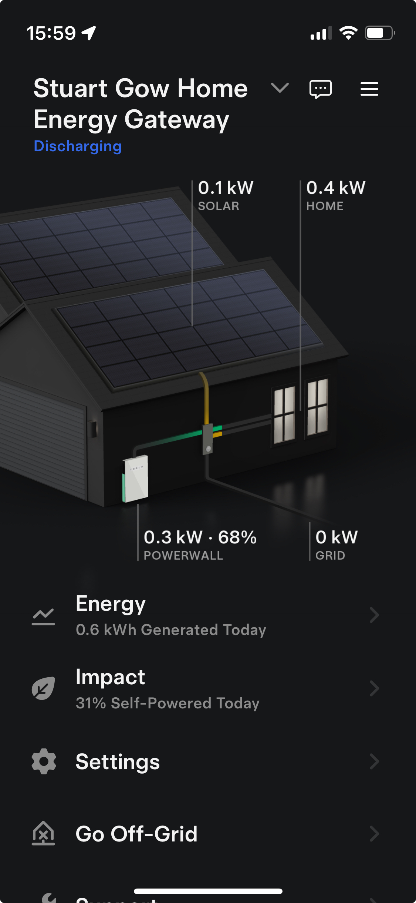

```{r setup, include=FALSE}
knitr::opts_chunk$set(echo = TRUE)
library(knitr)
options(digits = 4)
```

# Introduction (20 marks)

## Objectives

About six years ago, I decided to remove my reliance on oil and attempt to reduce my use of electricity imported from the National Grid. This was to try to reduce my energy costs and also as part of my small contribution towards reducing the use of fossil fuels. So I obtained installation costs and received estimates on how much energy I could generate by using solar panels. The existing setup of oil powered central heating was replaced by an installation of a solar panel array, battery storage and ground source heat pump. The aim was to be able to export surplus electricity and only import when generation and storage failed to meet the demands of the house.

My main objective is to see if the installation meets the predictions made during the sales process and to what extent I no longer have to rely on imported electricity, ie how effective the overall installation is and would, for example, additional battery storage improve it. I used a sample of data for the month of September 2024 as a hopefully representative month (ie not the height of summer with peak solar generation and not winter with low solar generation and peak consumption).

In the final report, R code and outputs have been shown to demonstrate working, however to reduce the size of the document this is suppressed if repeating previous workings. It is obviously all available in the submitted .rmd file.

## Summary of The Data

The data was collated from three original sources and combined into a single .txt file, then imported as an R dataframe.

```{r}
# Import all data from the tab-separated data file which is held in the data sub-folder
file_path <- './Data/Energy_September_2024.txt'
energy_df <- read.delim((file_path))
# Convert the string date to a valid date format
energy_df$Date <- as.Date(energy_df$Date, '%d/%m/%Y')
```

The data analysed comprises four parts, all daily data, 30 observations, for each day in September 2024:

-   Weather: Temperature and solar irradiance readings
-   Energy Use: Electricity consumption
-   Energy Source: The source of electricity: solar, battery or import from the grid
-   *Occupied*: The approximate number of hours the house is occupied each day

All data and supporting files can be found online at [Github](https://github.com/StuartG24/Home-Solar-Usage-Analysis).

### Weather

Weather data is sourced from the [Balquhidder Weather Station](https://www.blscc.org/weather) and consists of:

-   *Temp* - the mean daily temperature in $^\circ$C which is derived from 6 readings taken at 4 hourly intervals over a 24 hour period
-   *Irrdnce* - irradiance, a measure of the solar energy experienced over a specified area, units are kW/m$^2$ or W/m$^2$ and this is used to calculate the theoretical power generated from an array of solar panels[^1]

[^1]: Wikipedia: <https://en.wikipedia.org/wiki/Solar_irradiance>

### Energy Use & Source

The distribution of power for the house is managed by a Tesla Powerwall and Controller and an iPhone app is used to monitor this, see Figure 1. All electricity data was downloaded via this app. The imported electricity data was in Wh but is usually reported in kWh.

Electricity used and where it is sourced from:

-   *Home_Total* - total energy used by the house
-   *From_Solar* - solar power generated by an array of 36 solar panels
-   *From_PWall* - battery storage
-   *From_Grid* - the national power grid

Electricity generated by the solar panels and where it is used (the controller intelligently makes the routing decisions):

-   *Solar_Total* - total energy generated by the solar panels
-   *To_Home* - consumption by the house
-   *To_PWall* - for battery storage
-   *To_Grid* - export to the national power grid

***TO DO:** Tidy up table columns display .... look at Pandoc options etc to change layout for table and whole document? <https://pandoc.org/MANUAL.html#synopsis>*

Once the sources of data have been collated and loaded the dataset consists of 30 observations and 12 columns. The first 6 rows are shown below:

```{r, size="small"}
# Display the first 6 rows of the data
#head(energy_df)
kable(head(energy_df), caption = 'First 6 Rows of the source dataset')
```

{width="40%"}

# Methods and Results - (40 marks)

The data was analysed in several groups and themes, in summary:

-   Electricity Consumption - What drives snergy consumption?
-   Solar Energy Sufficiency - How well does solar meet energy demand?
-   Solar Generation Effectiveness - How well does the installation meet sales promises?
-   ???

***WIP - Analysis, expected conclusions:***

1)  See ideas in notebook, 17/11
2)  Fishers exact test
3)  Full year projections, observations
4)  Consumption is covered by solar .. or not? how much? how much grid still needed
5)  Consumption is linked to temperature and house occupancy
6)  Solar generation is linked to irradiance .. but how much?
7)  Any other links such as temperature? .. probably not usage or occupancy though?
8)  ?? Cannot account for £ cost and different costs at times of day .. battery importing then for example
9)  ?? Battery timing in and out complicates the analysis?
10) Increased battery will smooth out across days? forecast storage/impact .. but can't see the intra-day detail to better analyse
11) Solar generation meets the forecasts at purchase .. need original data/estimates!?

## Electricity Consumption

The energy consumption of the house was compared to the weather and its occupancy. The diagram below summarises this. The temperature and occupancy values have been scaled to only show the relative size and so no values are displayed.

```{r, fig.dim=c(8,5), fig.align='center'}
# Base barplot of energy consumption
barplot_result <- barplot(energy_df$Home_Total/1000, names.arg = format(energy_df$Date, "%d %b"), 
        cex.name=0.9, las=2, cex.axis=0.7, main="Daily Energy Consumption vs Weather & Occupancy", 
        ylab="Electricity kWh", ylim=c(0,25), col = 'lightblue', space = 1.5)

# Add scaled lines for temperature and occupancy
scaled_temp <- energy_df$Temp * max(energy_df$Home_Total/1000) / max(energy_df$Temp)
lines(barplot_result, scaled_temp, type = 'l', col = "red")
scaled_occ <- energy_df$Occupied * max(energy_df$Home_Total/1000) / max(energy_df$Occupied)
lines(barplot_result, scaled_occ, type = 'h', col = "darkblue", lwd = 2)

legend('top', legend=c("Electricty", "Temperature", "Occupancy"),
       fill=c("lightblue", "red", "darkblue"), cex = 0.6)
```

It was expected that the energy demand from the house should be related to the occupancy and the temperature although visually there does not appear to be a strong link with temperature but potentially there is a link with occupancy. So three linear regressions were carried out to better identify any relationships.

First looking at the relationship between energy demand and occupancy.

```{r, fig.dim=c(6,3.5), fig.align='center'}
# Plots and linear regression for energy and occupancy
regression_model <- lm(energy_df$Home_Total/1000 ~ energy_df$Occupied)
regression_summary <- summary((regression_model))
alpha <- regression_summary$coefficients["(Intercept)", "Estimate"]
beta <- regression_summary$coefficients["energy_df$Occupied", "Estimate"]
p_value <- regression_summary$coefficients["energy_df$Occupied", "Pr(>|t|)"]
adj_r_squared <- regression_summary$adj.r.squared

plot(energy_df$Home_Total/1000 ~ energy_df$Occupied, main="Daily Energy Demand vs Occupancy", 
     xlab="Occupancy Hours", ylab="Electricity kWh", las=1, xlim=c(0,25))
abline(regression_model, col="darkblue")
```

The regression line determined was energy =`r format(alpha, digits=4)` ($\alpha$) + `r format(beta, digits=4)` ($\beta$) \* occupancy. This fit had a p-value of `r format(p_value, digits=3)` and adjusted R-squared of `r format(adj_r_squared, digits=2)`. For a linear regression the null hypothesis is that $\beta$ is zero, ie $H_0: \beta = 0$. Here the p-value is less than the 5% critical value and so we can reject $H_0$ and infer that energy and occupancy are correlated, however the relative low value of adjusted R-squared suggests that the correlation is not very strong.

Then looking at the relationship between energy demand and temperature (NB: same R Code so not printed to save space).

```{r, fig.dim=c(6,3.5), fig.align='center', echo=FALSE}
# Plots and linear regression for energy and temperature
regression_model <- lm(energy_df$Home_Total/1000 ~ energy_df$Temp)
regression_summary <- summary((regression_model))
alpha <- regression_summary$coefficients["(Intercept)", "Estimate"]
beta <- regression_summary$coefficients["energy_df$Temp", "Estimate"]
p_value <- regression_summary$coefficients["energy_df$Temp", "Pr(>|t|)"]
adj_r_squared <- regression_summary$adj.r.squared

plot(energy_df$Home_Total/1000 ~ energy_df$Temp, main="Daily Energy Demand vs Temperature", 
     xlab="Temperature", ylab="Electricity kWh", las=1, xlim=c(0,20),ylim=c(0,40))
abline(regression_model, col="darkblue")
#print(sprintf("Alpha: %.3f, Beta: %.3f", alpha, beta))
#print(sprintf("p-value: %.4f, Adj R-Squared: %.3f", p_value, adj_r_squared))
```

The regression line determined was energy =`r format(alpha, digits=4)` ($\alpha$) + `r format(beta, digits=4)` ($\beta$) \* temperature. This fit had a p-value of `r format(p_value, digits=3)` and adjusted R-squared of `r format(adj_r_squared, digits=2)`. Here the p-value is less than the 5% critical value and so we can reject $H_0$ and infer that energy and temperature are inversely correlated, however the relative low value of adjusted R-squared suggests that the correlation is not very strong.

Then a multi-linear regression was performed looking at the relationship between energy demand and temperature plus occupancy (NB: A three dimensional scatter plot was not attempted).

```{r, fig.dim=c(6,4), fig.align='center', echo=TRUE}
# Multiple linear regression for energy and occupancy + temperature
regression_model <- lm(energy_df$Home_Total/1000 ~ energy_df$Temp + energy_df$Occupied)
regression_summary <- summary((regression_model))
alpha <- regression_summary$coefficients["(Intercept)", "Estimate"]
beta0 <- regression_summary$coefficients["energy_df$Occupied", "Estimate"]
p_value0 <- regression_summary$coefficients["energy_df$Occupied", "Pr(>|t|)"]
beta1 <- regression_summary$coefficients["energy_df$Temp", "Estimate"]
p_value1 <- regression_summary$coefficients["energy_df$Temp", "Pr(>|t|)"]
adj_r_squared <- regression_summary$adj.r.squared

#print(sprintf("Alpha: %.3f, Beta Occupancy: %.3f, Beta Temp: %.3f", alpha, beta0, beta1))
#print(sprintf("p-value Occp: %.4f, p-value Temp: %.4f, Adj R-Squared: %.3f", p_value0, p_value1, adj_r_squared))
```

The regression line determined was energy = `r format(alpha, digits=4)` ($\alpha$) + `r format(beta0, digits=4)` ($\beta$) \* occupancy + `r format(beta1, digits=4)` ($\beta$) \* temperature This fit had a p-value of `r format(p_value0, digits=3)` for occupancy and `r format(p_value1, digits=3)` for temperature and adjusted R-squared of `r format(adj_r_squared, digits=2)`. Here both p-values are less than the 5% critical value and so we can reject $H_0$ and infer that energy and occupancy plus temperature (inversely) are correlated, the high value of adjusted R-squared suggests that the correlation is quite strong.

***!! TO DO: For conclusions section ... temperature not massive due to good insulation and also not extremely cold etc ... but intercept does indicate as it gets colder then increases***

## Solar Energy Sufficiency

***!! work on this ....***

Next, the energy demands of the house were examined to see how well solar generated power matched this and how much imported electricity is needed to fill the gaps.

?? plot ?? in line figures rather than printed...

The first bar plot below shows the total energy consumed per day by the house and a breakdown of where this energy is sourced from. It appears that the energy generated by the solar panels only meets a small proportion of the total daily consumption, on average 26%.

```{r}
average_solar_percent <- mean(c(energy_df$From_Solar / energy_df$Home_Total)) * 100
print(paste("Straight percentage:", average_solar_percent))
```

However, this is misleading as generated solar energy is often first stored in the battery for later use or exported to the gird if the battery becomes full. The second bar plot shows this more clearly. With solar energy distributed to the home, the battery or exported to the grid on average: 62%, 30% and 8% respectively.

```{r}
solar_home_percent <- mean(c(energy_df$To_Home / energy_df$Solar_Total)) * 100
solar_powerwall_percent <- mean(c(energy_df$To_Pwall / energy_df$Solar_Total)) * 100
solar_grid_percent <- mean(c(energy_df$To_Grid / energy_df$Solar_Total)) * 100
print(paste("To Home:", solar_home_percent, "To Powerwall:", solar_powerwall_percent,
            "To Grid:", solar_grid_percent))
```

A good measure of how well the solar generation meets the needs of the house's energy consumption is to simply look at how much usage is catered for without any import from the grid, and this is 80% on average.

```{r}
adjusted_solar_percent <- mean(c((energy_df$Home_Total - energy_df$From_Grid) / 
                                    energy_df$Home_Total)) * 100
print(paste("Without Grid Imported:", adjusted_solar_percent))
```

## Solar Generation Effectiveness

The amount of energy generated by solar panels is a function of their size and the level of sunshine received, measured by irradiance. There is also a loss factor that reflects several things including the panel's efficiency and the invertor's efficiency. Additionally, irradiance observations are taken from local weather stations which may not experience the same shading from the sun as that experienced at the site of the solar panels. $$ Power (kWh) = Area (m^2) * Irradiance (kWh/m^2) * LossFactor$$

```{r, echo=TRUE}
# The installation assumptions
solar_panels_count <- 36
solar_panels_area <- solar_panels_count * 2
solar_panels_max <- solar_panels_count * 275
solar_estimated_pa <- 7920
loss_factor <- solar_estimated_pa / solar_panels_max
irradiance_assumed <- solar_panels_max / solar_panels_area
```

At installation, the annual generation power for this solar array was calculated as `r format(solar_estimated_pa, digits=2, big.mark=",")` kWh pa using an area of `r solar_panels_area` $m^2$, irradiance `r irradiance_assumed` kWh/$m^2$ pa and a loss factor of `r loss_factor`. Using the September observations of irradiance and generated solar energy, the effectiveness of the installation can be compared to the estimates (sales promises) made originally. It is very likely that the sales estimates were optimistic.

***!! Does the irradiance figure above tally with observed irradiance***

*Quick Validation*

```{r, fig.dim=c(6,4), fig.align='center', echo=TRUE}
# For solar generation, how well is this predicted by irradiance?
regression_model <- lm(energy_df$Solar_Total/1000 ~ energy_df$Irrdnce)
regression_summary <- summary(regression_model)

plot(energy_df$Solar_Total/1000 ~ energy_df$Irrdnce)
abline(regression_model)
alpha <- regression_summary$coefficients["(Intercept)", "Estimate"]
beta0 <- regression_summary$coefficients["energy_df$Irrdnce", "Estimate"]
p_value1 <- regression_summary$coefficients["energy_df$Irrdnce", "Pr(>|t|)"]
adj_r_squared <- regression_summary$adj.r.squared

#print(sprintf("Alpha: %.3f, Beta Irradiation: %.3f", alpha, beta0))
#print(sprintf("p-value Irradiation: %.4f, Adj R-Squared: %.3f", p_value0, adj_r_squared))
# Good fit between solar energy and irradiation with p-value < 5% and a high r-squared
```

It was expected that the generated solar energy is related to the irradiance and a quick scatter plot and linear regression confirmed this, with a p-value `r ifelse(p_value1 < 0.005, "< 0.005", round(p_value1, 3))` and a high adjusted r-squared `r format(adj_r_squared, digits=2)`.

*T-Test to Evaluate Effectiveness*

```{r, echo=FALSE, include=FALSE}
# Compare the actual solar energy against the predicted energy based on  irradiance
solar_predicted <- energy_df$Irrdnce/1000 * solar_panels_area * loss_factor
#summary(energy_df[,c("Solar_Total", "Irrdnce", "Temp")])
summary(energy_df$Solar_Total/1000)
sum(energy_df$Solar_Total/1000)
summary(solar_predicted)
sum(solar_predicted)

plot(energy_df$Solar_Total/1000 ~ energy_df$Date, type = "l", col = "blue")
plot(solar_predicted ~ energy_df$Date, type = "l", col = "lightblue")
plot(energy_df$Irrdnce/1000 ~ energy_df$Date, type = "l", col = "red")
plot(energy_df$Temp ~ energy_df$Date, type = "l", col = "green")
```

A prediction of the daily solar energy was calculated using the formulae above and using the actual irradiance observations. The actual and predicted solar energy daily totals are compared in the plot below and the means for the month are `r format(mean(energy_df$Solar_Total/1000), digits=3)` kWh and `r format(mean(solar_predicted), digits=3)` kWh respectively.

```{r, fig.dim=c(8,5), fig.align='center', echo=FALSE}
# Barplot of solar generation & solar predicted
barplot_result <- barplot(energy_df$Solar_Total/1000, names.arg = format(energy_df$Date, "%d %b"), 
        cex.name=0.9, las=2, cex.axis=0.7, main="Daily Solar Generation vs Predicted", 
        ylab="Electricity kWh", ylim=c(0,20), col = 'blue', space = 1.5)
lines(barplot_result, solar_predicted, type = 'h', col = "orange", lwd = 2)
legend('top', legend=c("Actual Observed", "Predicted"),
       fill=c("blue", "orange"), cex = 0.6)


```

The null hypothesis is that the installation performs as well as the sales promises; specifically that the average daily energy production in September $\mu_{act}$ is the same as that promised, expected $\mu_{exp}$. $$H_0:\mu_{act} = \mu_{exp}$$ the alternative hypothesis is that the installation does not perform as promised $$H_1:\mu_{act} < \mu_{exp}$$

A T-Test was performed to evaluate $H_0$ and to calculate the p-value which is the probability, if $H_0$ is true, of obtaining the observation, or an observation more extreme. In this case more extreme is that the actual mean observed is less than the expected mean because we anticipate that the installation does not perform as well as the sales promises. A one-tailed test was used.

```{r}
# Evaluate the T-Test
t_test_result <- t.test(energy_df$Solar_Total/1000, solar_predicted, alternative = "less")
#print(sprintf("p-value: %.4f", t_test_result$p.value))
```

The p-value is `r ifelse(t_test_result$p.value< 0.005, "< 0.005", round(t_test_result$p.value, 3))` which is statistically significant and the null hypothesis can be rejected at the 5% level. From this we can infer that the installation is not generating solar energy as effectively as originally promised.

xxxxxxxxxxxxxxxxx

## ?? Predict annual generation using non September

?? monthly irradiance data: <https://re.jrc.ec.europa.eu/pvg_tools/en/#MR>

\newpage

# Conclusions - 20 marks

##?? Discussion

*TO DO: Structure into two sections*

##?? Conclusion

Test citations [@Crawley2014] and as @Fraix-Burnet2016

@spiegel2012

\newpage

# Appendices

### *?? Energy Consumption ....*

```{r, fig.dim=c(8,5), fig.align='center', echo=FALSE}
# Convert to matrix for stacked bar plot
usage <- t(energy_df)[c("From_Solar", "From_Pwall", "From_Grid"), ]
barplot(usage, names.arg = format(energy_df$Date, "%d %b"), 
        cex.name=0.9, las=2, cex.axis=0.7, 
        main="Daily Energy Consumption & Sources", ylab="Electricity Wh", 
        col=3:1, ylim=c(0,25000))
legend('top', legend=c("From_Solar", "From_Pwall", "From_Grid"), title="Sources", 
       fill = 3:1, cex = 0.6)
```

```{r, fig.dim=c(8,5), fig.align='center', echo=FALSE}
# Convert to matrix for stacked bar plot
generation <- t(energy_df)[c("To_Home", "To_Pwall", "To_Grid"), ]
barplot(generation, names.arg = format(energy_df$Date, "%d %b"), 
        cex.name=0.9, las=2, cex.axis=0.7, 
        main="Daily Solar Generation & Target", ylab="Electricity Wh", 
        col=3:1, ylim=c(0,25000))
legend('top', legend=c("To-Home", "To_Pwall", "To_Grid"), title="Targets", 
       fill = 3:1, cex = 0.6)
```

# References
